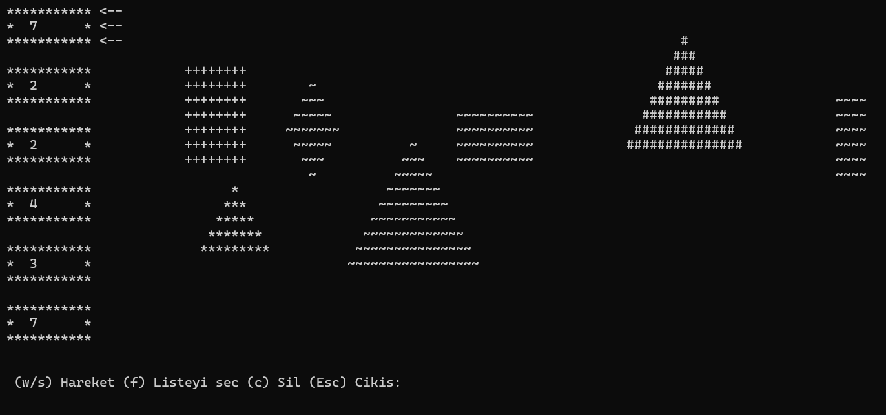
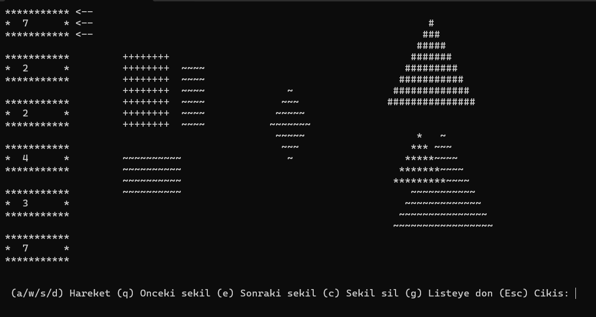

# 🎨 ASCII Shape Editor (Console Application)

Academic project developed during my second year of the **Computer Engineering degree at Sakarya Üniversitesi**.

This project was developed for the **Data Structures** course using **C++**, **Object-Oriented Programming**, and **custom linked data structures**.

The application is an interactive ASCII scene editor that allows users to navigate through nested linked lists, manipulate geometric shapes, and render them in real time inside a character-based console buffer.

---

## 🛠 Technologies And Concepts

- C++
- Object-Oriented Programming (OOP)
- MinGW (G++)
- Makefile

---

## ✨ Features

- Interactive ASCII scene editor
- Random scene generation
- Load scenes from file
- Save scenes to file
- Shape movement
- Shape deletion
- Keyboard navigation
- Z-index based rendering
- Real-time console rendering
- File persistence
- Nested linked list architecture

---

## ⚙️ Rendering Engine

Instead of drawing directly to the console, the application renders every frame into a **2D character buffer**.

Shapes are stored using an **ordered insertion strategy**, where each shape is inserted according to its **Z-index**. This allows the scene to be rendered correctly with a single traversal of the linked list, without requiring additional sorting during every frame.

---

## 💾 Persistence

The application supports complete scene persistence.

Users can:

- Generate a random scene
- Load an existing scene from disk
- Edit the scene interactively
- Save every modification before exiting

The entire scene hierarchy—including every node, shape, position, size, drawing character, and Z-index—is restored when the file is loaded.

---

## 📸 Screenshots

### Initial Random Scene



---

### Scene After Editing

The rectangles were moved to the left, the star/diamond was positioned at the center, and the triangles were moved to the right.



---

## 📄 Documentation

The `doc` folder contains:

- Project Report
- Original Assignment Specification

---

## ▶️ How to Build and Run

Open a terminal in the project's root directory and run:

```bash
mingw32-make
```

The Makefile automatically:

- Compiles all source files
- Generates the executable in the `bin` folder
- Launches the application

---

## 🎓 Academic Information

- **University:** Sakarya Üniversitesi
- **Department:** Computer Engineering
- **Course:** Data Structures
- **Academic Year:** 2025–2026
- **Project Grade:** **100/100**

---

## 📌 Notes

This repository preserves the original academic project developed for the **Data Structures** course.

As required by the assignment, the project **does not use STL containers** (such as `std::vector` or `std::list`). All linked data structures — including the nested lists used to manage the scene — were implemented from scratch.

The project also demonstrates the use of:

- Dynamic memory management
- Doubly and singly linked lists
- Inheritance
- Polymorphism
- Abstract classes
- File persistence
- Custom rendering through a character buffer

---

For more academic projects, visit my **Computer Engineering Projects** repository:

https://github.com/Lucaskatalahali/computer-engineering-projects
